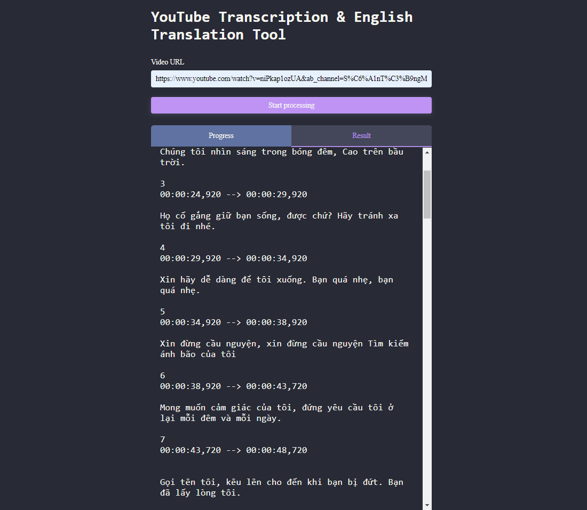

# Translate Tool


## Table of Contents

- [Introduction](#introduction)
- [Features](#features)
- [Installation](#installation)
- [Usage](#usage)

---

## Introduction

Translate Tool is a ReactJS application that utilizes Python and the OpenAI language model to generate transcripts from YouTube videos and provides translation services to translate the generated transcripts into Vietnamese.

---

## Features

- YouTube Video Transcript Generation: The Translate Tool allows users to input a YouTube video URL and automatically generates the corresponding transcript using the OpenAI language model. This feature provides a convenient way to extract text content from videos for further processing.

- Text Translation: The application leverages the power of the OpenAI language model to provide translation services. Users can translate the generated transcripts from various languages into Vietnamese, enabling multilingual content understanding and accessibility.

- Polite and Formal Style: The Translate Tool focuses on maintaining a polite and formal style in the translated text. This ensures that the translated content is appropriate for professional or formal contexts.

---

## Installation

1. Clone the repository:
   ```bash
   git clone https://github.com/hualocson/translate-tool.git
   ```
2. Navigate to the project directory:
   ```bash
   cd translate-tool
   ```
3. Install the required dependencies:
   ```bash
   pip install -r requirements.txt
   ```
4. Install node dependencies:
   ```bash
   npm install
   ```
5. Set up the OpenAI API key:
   - Obtain an API key from the OpenAI platform.
   - Create a `.env` file in the project root directory.
   - Add the following line to the `.env` file, replacing `YOUR_API_KEY` with your actual API key:
     ```bash
     OPENAI_API_KEY=YOUR_API_KEY
     ```

---
## Usage

1. Make sure you have set up your OpenAI API key by setting the `OPENAI_API_KEY` environment variable.

2. Run the script with the following command:
   ```bash
   npm start
   ```

Open your web browser and visit http://localhost:3000 to access the translate tools.
